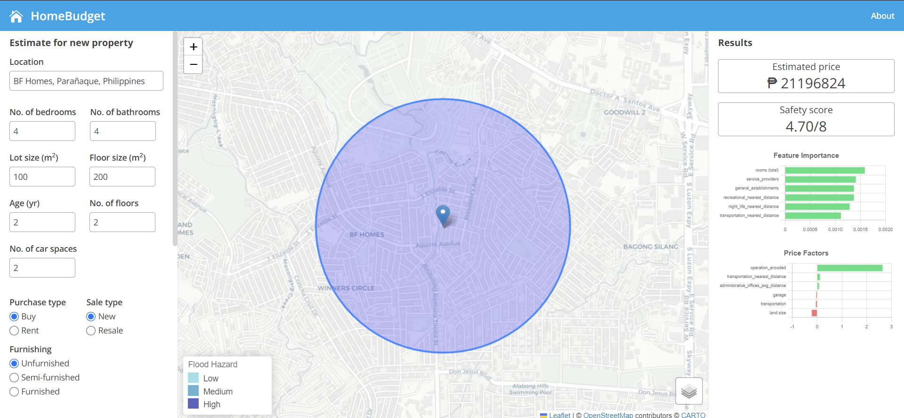

## Introduction 
HomeBudget helps homebuyers, sellers, and investors make informed decisions on residential properties. It does this by giving an estimated price of the property based on its information and a photo of the exterior of the property. The application also displays other information such as the perceived safety surrounding the property and the property’s price factors.Home Budget predicts the property price, perceived safety score, price factors of a property within Pasig and Parañaque cities.




## Getting Started
Link can be accessed at https://homebudget-comet.vercel.app/

### Offline installation
1. Clone the repository
```
git clone https://github.com/dyitsme/realestate_frontend.git
```
1. Have Node v21.6.1 installed [here](https://nodejs.org/en) 
2. Install the necessary libraries:

```bash
npm install
```
3. Run the development server:

```bash
npm run dev
```

Open [http://localhost:3000](http://localhost:3000) with your browser.


## Pages
- `/` shows the landing page
- `/map` displays the app dashboard
- `/about` displays the about page


